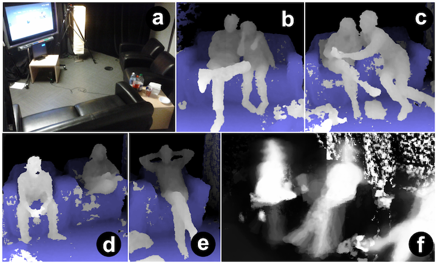
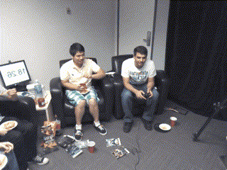

# BackgroundActivityIO

A C# wrapper for data generated as part of the [Background Activity Project](http://www.dgp.toronto.edu/~dustin/backgroundactivity/). See that page to request access to the full dataset.

The Background Activity Dataset embeds hand-based gestures in the context of naturalistic, multi-person background activity in a living room-like setting. 

## Usage and Dependencies

Only Windows is supported for data viewing at the moment.

Kinect for Windows SDK v1.8
https://www.microsoft.com/en-us/download/details.aspx?id=40278
(requires restart to link to Visual Studio properly)
